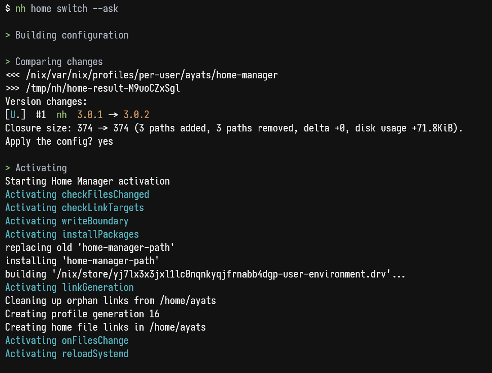

<h1 align="center">nh</h1>

<h6 align="center">Because the name "yet-another-<u>n</u>ix-<u>h</u>elper" was too long to type...</h1>

## What does it do?

NH reimplements some basic nix commands. Adding functionality on top of the existing solutions, like nixos-rebuild, home-manager cli or nix itself.

As the main features:
- Tree of builds with [nix-output-manager](https://github.com/maralorn/nix-output-monitor)
- Visualization of the upgrade diff with [nvd](https://github.com/maralorn/nix-output-monitor)
- Asking for confirmation before performing activation


<p align="center">
  
</p>


## Installation

nh is a flake-only tool, so to include it in your configuration add this flake into your flake's inputs:

```nix
{
  inputs.nh = {
    url = "github:viperML/nh";
    inputs.nixpkgs.follows = "nixpkgs"; # override this repo's nixpkgs snapshot
  };
}
```

Then, include it in your `environment.systemPackages` or `home.packages` by referencing the input:
```
inputs.nh.packages.<system>.default
```


### Configure **FLAKE** env variable

nh uses the `FLAKE` env variable as a default for `os` and `home`. This is a shorthand for `--flake` in other commands. This saves typing it every time.

For NixOS, configuring it could be as simple as:

```
environment.sessionVariables.FLAKE = "/home/ayats/Documents/dotfiles";
```

### NixOS module

A NixOS module is provided, that contains a systemd service and timer for `nh clean all`. Read the module source to know what is configurable [./module.nix](module.nix).

```nix
nixosConfigurations.foo = nixpkgs.lib.nixosSystem {
  modules = [
    inputs.nh.nixosModules.default
    {
      nh = {
        enable = true;
        clean.enable = true;
        clean.extraArgs = "--keep-since 4d --keep 3";
      };
    }
  ];
}
```

### Configure specialisations

NH is capable of detecting which spec you are running, so it runs the proper activation script.
To do so, you need to give NH some information of the spec that is currently running by writing its name to `/etc/specialisation`. The config would look like this:

```nix
{config, pkgs, ...}: {
  specialisation."foo".configuration = {
    environment.etc."specialisation".text = "foo";
    # ..rest of config
  };

  specialisation."bar".configuration = {
    environment.etc."specialisation".text = "bar";
    # ..rest of config
  };
}
```

### Configure the **NH_NOM** env variable

By default nh uses nix-output-monitor (nom) to show the build log. This can be disabled either by:

- Exporting the environment variable `NH_NOM=0`
- Overriding the package: `nh.override { use-nom = false; }`

### Binary cache

`nh` is built and pushed for every commit to my personal cachix cache.

```nix
{
  nix.settings = {
    extra-substituters = ["https://viperml.cachix.org"];
    extra-trusted-public-keys = ["viperml.cachix.org-1:qZhKBMTfmcLL+OG6fj/hzsMEedgKvZVFRRAhq7j8Vh8="];
  };
}
```

<details>
<summary>Why are specialisations broken with nixos-rebuild?</summary>

To understand why `nixos-rebuild` doesn't work[^1], we must know that it is just a shell wrapper around a more fundamental script from NixOS: `<toplevel package>/bin/switch-to-configuration`[^2].

This scripts has 2 possible commands: `boot` and `test`. What nixos-rebuild and nh do is basically building the toplevel pkg, and running `switch-to-configuration`. For `switch`, we run `test+boot` one after the other.

So, with specialisation, this changes. Specs create "another toplevel" under `<toplevel>/specialisation/<spec toplevel>`, with its own `/bin/switch-to-configuration`. Which one should we run?

- For `test`: `<toplevel>/specialisation/<spec>/bin/switch-to-configuration test`
- For `boot`: `<toplevel>/bin/switch-to-configuration boot`

We must run the namespaced one for `test`, and the root one for `boot`. Which is what `nixos-rebuild` doesn't do properly.


</details>

## Hacking

Just `nix develop`

[^1]: At the time of this writing.

[^2]: The toplevel package is what you can build with `nix build /flake#nixosConfiguration.HOSTNAME.config.system.build.toplevel`, and what sits on `/run/current-system`, `/run/booted-system` and `/nix/var/nix/profiles/system`.
